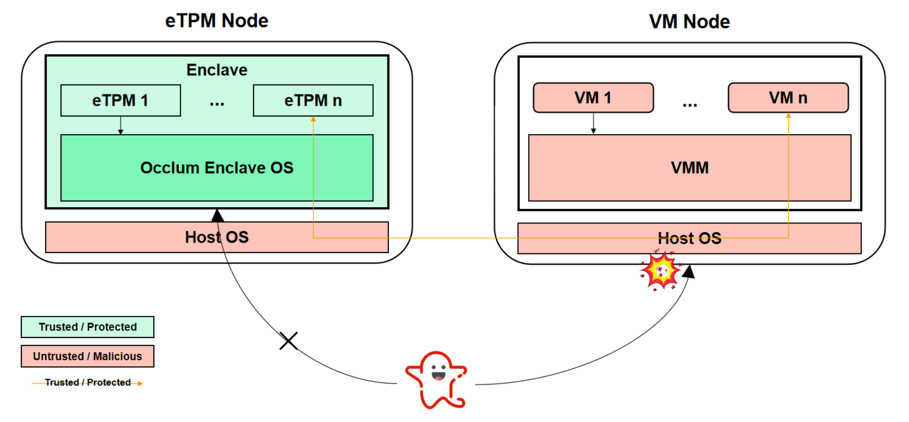

# Background
While virtual TPM (vTPM) has been widely deployed in a trusted cloud ,the existing vTPM scheme lacks protections of vTPM itself at a runtime environment. Recognizing the importance of safety-critical software security, there has been significant interest in hardening the software using security mechanisms, such as control-flow integrity, privilege specialization, mediation, etc. Common to all software approaches is the reliance on a trusted OS. However, modern OS are consolidating more and more functionalities with simultaneous inevitable vulnerabilities.

Trusted Execution Environment, which leverages hardware to provide attestable isolated execution environments, is getting prevalent on cloud platforms. TEE technologies, such as Intel SGX, are now a defacto solution for safety-critical software security. **Is it possible to protect vtpm using the application of hardware primitive with new software designs?**

There are some proposals for vTPM in TEE. Nevertheless, current proposals ignore channel security, complete support for TPM2.0 commands, and cumbersome reconstruction. We retrofit the previous solutions through three key designs. To tackle the first challenge, we enhance the channels between the vTPM and tss software stack using Rats-TLS protocol, a mutual transport layer security protocol that supports heterogeneous hardware executable environments. For the second challenge, we test our prototype using the full-fledged test cases in latest tpm2-tools repository. Lastly, we leverage Occlum to run the vTPM inside the enclave, which avoids tremendous effort to partition legacy code into enclave and non-enclave halves.

# Design & Implementation

We implemented a prototype of eTPM which accommodates two containers: the first one is domain of the tss software and the high-level application, we leverage tpm2-tools or APIs of tpm2-tss to launch testing commands; and the second is resided by eTPM in Occlum, which provides encryption, attestion and other safety-critical services. When an application process wants to request the remote eTPM service, it leverages tpm2-tools commands or APIs of tpm2-tss to connect with eTPM. The TPM2.0 commands are transmitted via channel enhanced by Rats-TLS. Remote eTPM receives commands from default port and runs the corresponding computing routines. eTPM uses the remote attestion to guarantee the integrity and confidentiality. Sender (eTPM) collaborates closely with Receiver (TSS): Sender (eTPM) transmits evidence collected in SGX enclave to Receiver (TSS). Then the mechanism of SGX remote attestion helps the latter to verify the correctness of messages. After negotiation, eTPM return the result to remote user to complete the single interaction.

# Further Work

The simulation using docker is not rigorous enough for the original assumptions. To cater to that, we need to offer the Proof of Concept equiped with system level virtual machine. We are retrofitting the TPM backend of QEMU with Rats-TLS and exploring the feasibility unprecedented "Microsoft TPM simulator-QEMU".

